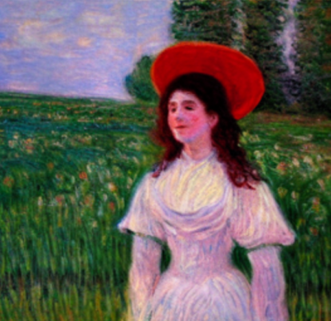
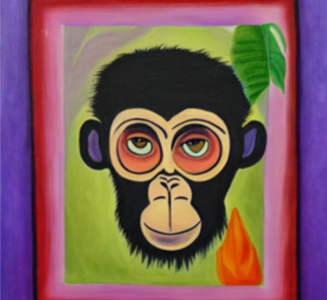

# 🎨 ArtPrompt – Generador de Cuadros con IA

Un proyecto que explora la unión entre **inteligencia artificial y creatividad artística**.  
El sistema permite generar imágenes en el estilo de pintores famosos a partir de **prompts escritos por el usuario**.

---

## Descripción
El objetivo fue investigar hasta qué punto un modelo de IA puede **aprender estilos artísticos** y aplicarlos a nuevas obras visuales.  
Para ello, diseñé un dataset propio de 5 artistas y entrené una red neuronal simple para clasificarlos, integrando después un pipeline de **Stable Diffusion** para la generación de imágenes.

El usuario puede:
- Seleccionar un **artista**.
- Escribir un **prompt personalizado**.
- Obtener una imagen generada en ese estilo.

---

## Tecnologías utilizadas
- **Lenguaje:** Python (Jupyter Notebook)  
- **Librerías:** TensorFlow / PyTorch, Matplotlib, PIL  
- **Modelos:** Stable Diffusion  
- **Interactividad:** widgets en notebook  

---

## Mi rol
- Creación manual del **dataset** con diferentes artistas.  
- Implementación de la **red neuronal** para clasificación inicial.  
- Integración de **Stable Diffusion** para la generación de imágenes.  
- Desarrollo de la interfaz interactiva con widgets.  

---

## 🖼️ Ejemplos de resultados
| Prompt | Artista seleccionado | Imagen generada |
|--------|----------------------|-----------------|
| "Woman in field" | Monet |  |
| "Self portrait monkey"   | Kahlo  |  | 

---
